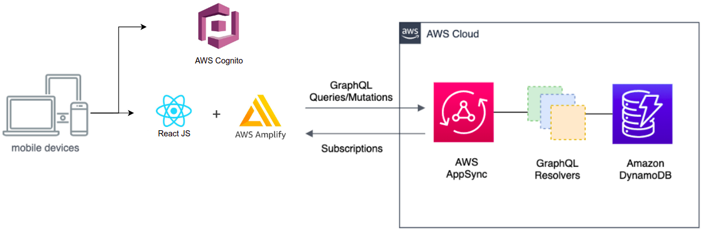
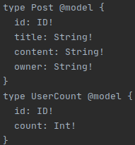
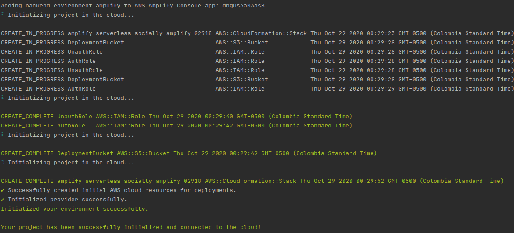
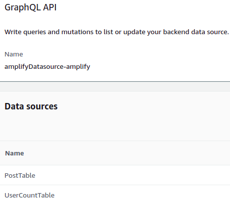
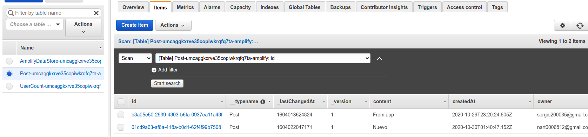
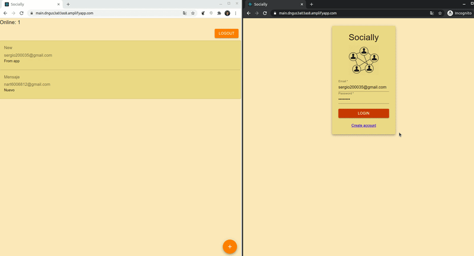

# Serverless app with AWS cognito and DynamoDB

In this laboratory we are trying to create a simple App that uses AWS infrastructure with the following requeriments:
* The application must allow users to register (create an account).
* The application must allow users to authenticate using a password.
* The application must use Cognito to manage user accounts.
* The application must grant integrity and authorization.
* The application implements a minimal facebook-like social network. Every connected user can post messages and every user will see the posted messages. Last posted message is shown on top.
* The application must show how many users are currently connected.
* The application must updated the post feed and the number of connected users in Real-time.
* Access to WS must be secure.
* Implement the simplest minimal application possible.

The project has the following architecture:

We use Amazon DynamoDB Stream through GraphQL subscriptions to make the Posts reactive, and the userCount

Our graphQL schema is pretty simple:

With help of AWS Amplify CLI we can build an Amazon CloudFormation schema with all the requirements for the infrastructure including
AppSync API and the DynamoDB tables and roles, permissions required to communicate the components.

The connection to AWS Cognito is Manual, through the AWS and Cognito SDK

With JavaScript, we manage to create a Full-Stack React Application with help of Amplify Backend API,
Cognito ensures security using an JWT token for each request with the API, also provide email verification.

**[Demo](https://main.dngus3a03as8.amplifyapp.com)**

## Author
* **[Sergio Rodríguez](https://github.com/SergioRt1)** 
  
## License
This project is license under the Apache-2.0 License - see the [LICENSE](LICENSE) file for more details.
